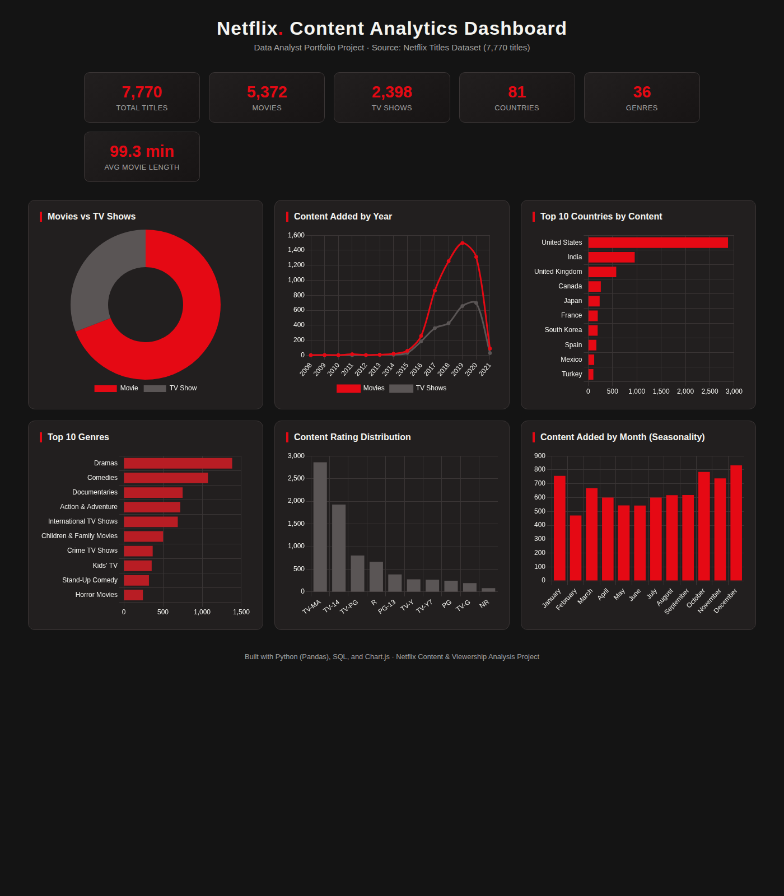

# 🎬 Netflix Content & Viewership Analysis


An end-to-end data analysis project on Netflix's global content catalog (7,770+ titles) — covering data cleaning, exploratory data analysis, SQL querying, and an interactive dashboard to uncover trends in content type, genre, country, rating, and release patterns.

---

## 📌 Project Overview

Netflix's content library spans thousands of titles across dozens of countries and genres. This project analyzes that catalog to answer questions a content strategy or analytics team would actually care about:

- Is Netflix investing more in Movies or TV Shows over time?
- Which countries and genres dominate the catalog?
- How has content acquisition changed year over year?
- What are the seasonal patterns in content releases?
- What does the content rating mix say about the target audience?

---

## 🗂️ Dataset

- **Source:** [Netflix Movies and TV Shows dataset](https://www.kaggle.com/shivamb/netflix-shows) (mirrored via [TidyTuesday](https://github.com/rfordatascience/tidytuesday))
- **Size:** 7,787 raw titles → 7,770 after cleaning
- **Fields:** title, type, director, cast, country, date added, release year, rating, duration, genre, description

---

## 🛠️ Tools & Tech Stack

| Category | Tools |
|---|---|
| Data Cleaning & Analysis | Python, Pandas, NumPy |
| Visualization | Matplotlib, Seaborn |
| Database / Querying | SQL (SQLite/PostgreSQL syntax) |
| Dashboard | HTML, CSS, Chart.js (interactive) |
| Notebook | Jupyter |

---

## 📁 Project Structure

```
netflix-data-analyst-project/
│
├── README.md                     ← you are here
├── requirements.txt
├── data/
│   ├── netflix_titles.csv               (raw dataset)
│   └── netflix_titles_cleaned.csv       (cleaned + feature-engineered)
├── notebooks/
│   ├── netflix_analysis.ipynb           (full cleaning + EDA notebook)
│   ├── data_cleaning.py                 (standalone cleaning script)
│   └── eda_analysis.py                  (standalone EDA script)
├── sql/
│   └── queries.sql                      (15 business-question SQL queries)
├── dashboard/
│   └── netflix_dashboard.html           (interactive dashboard, open in browser)
└── images/                              (exported charts + dashboard screenshot)
```

---

## 🧹 Data Cleaning Steps

1. Filled missing `director`, `cast`, `country` values with `"Not Specified"`
2. Dropped the small number of rows missing `rating` or `date_added`
3. Converted `date_added` to proper datetime format
4. Removed duplicate titles
5. Engineered new features: `year_added`, `month_added`, `duration_value`, `duration_type`, `primary_country`, `primary_genre`, `genre_count`, `days_release_to_add`

---

## 📊 Dashboard Preview



> Open `dashboard/netflix_dashboard.html` directly in any browser — it's fully interactive and self-contained (no server required).

---

## 📈 Key Insights

- **Movies dominate the catalog** — ~69% Movies vs ~31% TV Shows, though the TV Show share has grown steadily since 2016.
- **2019 was the peak year** for content additions, after which growth slowed — consistent with Netflix shifting from licensing to an originals-focused strategy.
- **The United States** produces the most content by far (2,874 titles), followed by India and the UK, reflecting Netflix's continued US-content reliance even while globalizing.
- **Dramas** are the single most common genre tag (1,383 titles), followed by Comedies and Documentaries.
- **TV-MA** is the most frequent content rating (2,861 titles) — the catalog skews toward mature audiences.
- Average movie runtime is **~99 minutes**, in line with standard feature-length films.
- **December** sees the highest volume of content additions of any month — likely timed to holiday-season viewing demand.

---

## 🗃️ Sample SQL Query

```sql
-- Top 5 genres per year using a window function
WITH genre_year_counts AS (
    SELECT
        year_added,
        primary_genre,
        COUNT(*) AS genre_count,
        RANK() OVER (
            PARTITION BY year_added
            ORDER BY COUNT(*) DESC
        ) AS genre_rank
    FROM netflix
    GROUP BY year_added, primary_genre
)
SELECT year_added, primary_genre, genre_count, genre_rank
FROM genre_year_counts
WHERE genre_rank <= 5
ORDER BY year_added, genre_rank;
```

See [`sql/queries.sql`](sql/queries.sql) for all 15 queries (covers JOINs, CTEs, window functions, aggregations, and HAVING clauses).

---

## ▶️ How to Run This Project

```bash
# 1. Clone the repo
git clone https://github.com/<your-username>/netflix-data-analyst-project.git
cd netflix-data-analyst-project

# 2. Install dependencies
pip install -r requirements.txt

# 3. Run the notebook
jupyter notebook notebooks/netflix_analysis.ipynb

# 4. View the dashboard
# Simply open dashboard/netflix_dashboard.html in your browser
```

---

## 🚀 Future Improvements

- Merge with IMDb ratings dataset for popularity-vs-rating correlation analysis
- Build a production dashboard in Power BI / Tableau with live filters
- Add NLP-based genre/description clustering
- Automate data refresh pipeline

---

## 📬 Contact

If you have feedback or questions about this project, feel free to reach out or open an issue.

---

*This project was built as a data analyst portfolio piece to demonstrate skills in data cleaning, exploratory data analysis, SQL, and dashboard building.*
